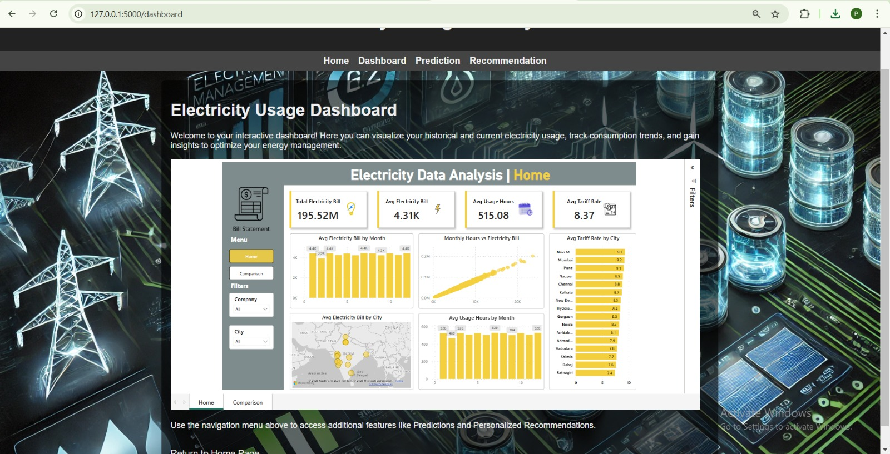
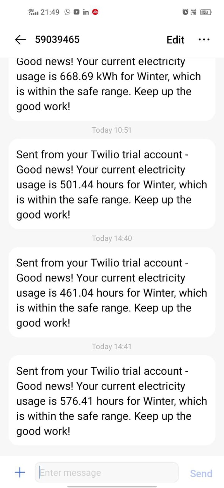

# AI-Powered Energy Usage Monitoring and Management System

This project is an AI-powered system designed to monitor and manage energy usage efficiently. It collects real-time energy consumption data, analyzes patterns using machine learning, and provides insights to optimize energy usage. The system helps reduce waste, lower costs, and improve sustainability by offering predictive analytics and automated recommendations.

## Features:
1.Real-time energy monitoring.

2.AI-driven consumption analysis.

3.Predictive energy usage optimization.

4.Automated alerts and recommendations.

## Requirements

1. Programming Language:Python 3.x: Used for the development of the project.
2. Essential Packages :pandas,numpy,scikit-learn,matplotlib,seaborn.

## Usage:

1. Clone the Repository
2. Install Dependencies
3. Run the Jupyter Notebook
4. Run the Web Interface
5. Input Data & Get Predictions

## Program:
```python
# Import necessary libraries

import pandas as pd
import numpy as np
import matplotlib.pyplot as plt
import seaborn as sns
from sklearn.preprocessing import StandardScaler, MinMaxScaler
from sklearn.preprocessing import OneHotEncoder, LabelEncoder
from sklearn.model_selection import train_test_split
from sklearn.linear_model import LinearRegression
from sklearn.tree import DecisionTreeRegressor
from sklearn.ensemble import RandomForestRegressor
from sklearn.metrics import mean_squared_error, r2_score
import warnings
warnings.filterwarnings("ignore")

#Electricity Dataset

electricity_data = '/content/drive/My Drive/Energy_management_system/electricity_bill_dataset_updated.csv'
df = pd.read_csv(electricity_data)
df.head(10)
df.describe()
df.info()
df.drop('MotorPump',axis = 1, inplace = True)
df.shape

# Exploratory Data Analysis

avg_hour = df.groupby('Month')[['Fan','Refrigerator','AirConditioner','Television','Monitor']].mean().reset_index()
avg_hour
monthly_bills = df.groupby('Month')[['ElectricityBill']].sum().reset_index()
monthly_bills
monthly_bills['Month'] = monthly_bills['Month'].map({1:'Jan',2:'Feb',3:'Mar',4:'Apr',5:'May',6:'Jun',7:'Jul',8:'Aug',9:'Sep',10:'Oct',11:'Nov',12:'Dec'})
plt.figure(figsize = (10,6))
sns.barplot(x = 'Month', y = 'ElectricityBill', data = monthly_bills)
plt.title('Overall Monthly Electricity Bill',fontsize = 15, fontweight = 'bold')
plt.xlabel('Month',fontweight = 'bold')
plt.ylabel('Electricity Bill',fontweight = 'bold')
plt.show()
plt.figure(figsize = (10,6))
sns.scatterplot(x = 'MonthlyHours', y = 'ElectricityBill', data = df, color = 'green')
plt.title('Monthy Electricity usage vs Electricity Bill', fontsize = 15, fontweight = 'bold')
plt.xlabel('Monthly usage (Hours)',fontweight = 'bold')
plt.ylabel('Electricity Bill',fontweight = 'bold')
plt.show()
city_bills = df.groupby('City')[['ElectricityBill']].sum().reset_index()
city_bills
plt.figure(figsize = (10,6))
sns.barplot(x = 'City', y = 'ElectricityBill', data = city_bills.sort_values(by = 'ElectricityBill', ascending = False).head(5), color = 'red')
plt.title('Top 5 cities based on Electricity Bill', fontsize = 15, fontweight = 'bold')
plt.xlabel('City',fontweight = 'bold')
plt.ylabel('Electricity Bill',fontweight = 'bold')
plt.show()
df.head()
numerical_columns = ['Fan',	'Refrigerator',	'AirConditioner',	'Television',	'Monitor','MonthlyHours', 'TariffRate', 'ElectricityBill']

fig, axes = plt.subplots(nrows=4, ncols=2, figsize=(10, 12))
axes = axes.flatten()

for i, column in enumerate(numerical_columns):
    if column in df.columns:
        sns.boxplot(data=df, x=column, ax=axes[i])
        axes[i].set_title(column)
    else:
        print(f"Column {column} not found in DataFrame!")

for j in range(i + 1, len(axes)):
    fig.delaxes(axes[j])

plt.tight_layout()
plt.show()

plt.figure(figsize=(15, 12))
for i, column in enumerate(numerical_columns, 1):
    plt.subplot(3, 3, i)
    sns.histplot(df[column], kde=True, bins=20, color='skyblue')
    plt.title(f'Distribution of {column}')
    plt.xlabel(column)
    plt.ylabel('Frequency')

plt.tight_layout()
plt.show()

def numeric_univariate_analysis(df, numerical_columns):
    for col_name in numerical_columns:
        print('*' * 5, col_name, '*' * 5)
        print(df[col_name].agg(['min', 'max', 'mean', 'median', 'std', 'skew']))
        print()
numerical_columns = ['MonthlyHours','TariffRate','ElectricityBill']
numeric_univariate_analysis(df, numerical_columns)

def categorical_univariate_analysis(cat_data):
    for col_name in cat_data.columns:
        print('*' * 5, col_name, '*' * 5)
        print('Count:', cat_data[col_name].count())
        print('Unique values:', cat_data[col_name].nunique())
        print('Unique categories:', cat_data[col_name].unique())
        print()
categorical_univariate_analysis(df[['City','Company']])

renewable_data = '/content/drive/My Drive/Energy_management_system/electricity_data_renewable.csv'
df_renewable = pd.read_csv(renewable_data)
df_renewable.head()
df_renewable.describe()
df_renewable.info()
df_usage = df_renewable.groupby(['Renewable_Energy_Usage'])[['Bill_Amount_INR']].mean().reset_index()
df_usage
from scipy.stats import ttest_ind

renewable_bills = df_renewable[df_renewable['Renewable_Energy_Usage'] == 1]['Bill_Amount_INR']
conventional_bills = df_renewable[df_renewable['Renewable_Energy_Usage'] == 0]['Bill_Amount_INR']

t_stat, p_value = ttest_ind(renewable_bills, conventional_bills, equal_var=False)

print(f"T-statistic: {t_stat:.4f}, P-value: {p_value:.4f}")
if p_value < 0.05:
    print("The difference in electricity bills between renewable and conventional users is statistically significant.")
    print("Renewable energy users consistently pay lower bills.")
else:
    print("No significant difference in electricity bills between renewable and conventional users.")
    print("The observed difference could be due to chance, requiring further analysis.")

# Data Preprocessing
df.isnull().sum()
df.head()
df_appliances = df.iloc[:, :5]
df_appliances.head()
df["Max_Consumption(day)"] = df_appliances.max(axis=1)
df.head()
#Feature Selection
X = df.drop(['ElectricityBill'], axis = 1)
y = df['ElectricityBill']
X_train, X_test, y_train, y_test = train_test_split(X, y, test_size=0.2, random_state=42)
#Feature Encoding
le = LabelEncoder()
X_train['City'] = le.fit_transform(X_train['City'])
X_test['City'] = le.transform(X_test['City'])
X_train['Company'] = le.fit_transform(X_train['Company'])
X_test['Company'] = le.transform(X_test['Company'])
X_train.head()
#Feature Importance
rf = RandomForestRegressor()
rf.fit(X_train,y_train)
importances = rf.feature_importances_
feature_names = X_train.columns
feature_importance_df = sorted(zip(feature_names, importances), key=lambda x: x[1], reverse=True)
features, importance_values = zip(*feature_importance_df)

plt.figure(figsize=(10, 5))
plt.barh(features, importance_values, color='skyblue')
plt.xlabel("Feature Importance")
plt.ylabel("Features")
plt.title("Random Forest Feature Importance")
plt.gca().invert_yaxis()
plt.show()

X_train = X_train.drop(['City','Month','Max_Consumption(day)','Television','Company','Fan','Refrigerator','Monitor','AirConditioner'], axis = 1)
X_test = X_test.drop(['City','Month','Max_Consumption(day)','Television','Company','Fan','Refrigerator','Monitor','AirConditioner'], axis = 1)
X_train.head()

##Model building
#Linear Regression
print("Coefficients:", lr_model.coef_)
print("Intercept:", lr_model.intercept_)
y_train_pred_lr = lr_model.predict(X_train)
train_mse = mean_squared_error(y_train, y_train_pred_lr)
train_r2 = r2_score(y_train, y_train_pred_lr)

y_test_pred_lr = lr_model.predict(X_test)
test_mse = mean_squared_error(y_test, y_test_pred_lr)
test_r2 = r2_score(y_test, y_test_pred_lr)

print(f"Train MSE: {train_mse}, Train R²: {train_r2}")
print(f"Test MSE: {test_mse}, Test R²: {test_r2}")
n = len(y_test)
p = X_test.shape[1]
r2_adj = 1 - (1 - test_r2) * (n - 1) / (n - p - 1)

print("R-squared:", test_r2)
print("Adjusted R-squared:", r2_adj)
#Decision Tree
dt_model = DecisionTreeRegressor()
dt_model.fit(X_train, y_train)
y_train_pred_dt = dt_model.predict(X_train)
train_mse = mean_squared_error(y_train, y_train_pred_dt)
train_r2 = r2_score(y_train, y_train_pred_dt)

y_test_pred_dt = dt_model.predict(X_test)
test_mse = mean_squared_error(y_test, y_test_pred_dt)
test_r2 = r2_score(y_test, y_test_pred_dt)

print(f"Train MSE: {train_mse}, Train R²: {train_r2}")
print(f"Test MSE: {test_mse}, Test R²: {test_r2}")
n = len(y_test)
p = X_test.shape[1]
r2_adj = 1 - (1 - test_r2) * (n - 1) / (n - p - 1)

print("R-squared:", test_r2)
print("Adjusted R-squared:", r2_adj)
#Random Forest
rf = RandomForestRegressor(n_estimators = 500, random_state = 42)
rf.fit(X_train, y_train)
y_train_pred_rf = rf.predict(X_train)
train_mse = mean_squared_error(y_train, y_train_pred_rf)
train_r2 = r2_score(y_train, y_train_pred_rf)

y_test_pred_rf = rf.predict(X_test)
test_mse = mean_squared_error(y_test, y_test_pred_rf)
test_r2 = r2_score(y_test, y_test_pred_rf)

print(f"Train MSE: {train_mse}, Train R²: {train_r2}")
print(f"Test MSE: {test_mse}, Test R²: {test_r2}")
n = len(y_test)
p = X_test.shape[1]
r2_adj = 1 - (1 - test_r2) * (n - 1) / (n - p - 1)

print("R-squared:", test_r2)
print("Adjusted R-squared:", r2_adj)
#Gradient Boost
from sklearn.ensemble import GradientBoostingRegressor
gb = GradientBoostingRegressor()
gb.fit(X_train, y_train)
y_train_pred_gb = gb.predict(X_train)
train_mse = mean_squared_error(y_train, y_train_pred_gb)
train_r2 = r2_score(y_train, y_train_pred_gb)

y_test_pred_gb = gb.predict(X_test)
test_mse = mean_squared_error(y_test, y_test_pred_gb)
test_r2 = r2_score(y_test, y_test_pred_gb)

print(f"Train MSE: {train_mse}, Train R²: {train_r2}")
print(f"Test MSE: {test_mse}, Test R²: {test_r2}")
n = len(y_test)
p = X_test.shape[1]
r2_adj = 1 - (1 - test_r2) * (n - 1) / (n - p - 1)

print("R-squared:", test_r2)
print("Adjusted R-squared:", r2_adj)
y_test
y_test_pred_rf
X_test.head(20)
rf.predict([[465 ,7.9]])
#Saving the model
import joblib
joblib.dump(rf, 'energy_management_system.pkl')
#Recommendation Logic
import joblib
model = joblib.load('energy_management_system.pkl')
import numpy as np
def get_valid_hour():
    while True:
        try:
            hour = int(input("Enter the Monthly usage hours (96 - 926): "))
            if 96 <= hour <= 926:
                return hour
            else:
                print("Error: The Monthly usage hours should be between 96 and 926. Try again.")
        except ValueError:
            print("Error: Invalid input. Please enter a valid integer.")

def get_valid_tariff():
    while True:
        try:
            tariff = float(input("Enter the Tariff rate (7.4 - 9.3): "))
            if 7.4 <= tariff <= 9.3:
                return tariff
            else:
                print("Error: The Tariff rate should be between 7.4 and 9.3. Try again.")
        except ValueError:
            print("Error: Invalid input. Please enter a valid decimal number.")

hour = get_valid_hour()
tariff = get_valid_tariff()

bill_array = np.array([[hour, tariff]])

if "model" not in globals():
    raise ValueError("Model is not defined. Please load the trained model.")

predicted_output = model.predict(bill_array)

print(f"Predicted Bill: {predicted_output[0]}")

##Recommendation System
#Import the necessary libraries
import pandas as pd
import numpy as np
import matplotlib.pyplot as plt
import seaborn as sns
from sklearn.cluster import KMeans
import joblib
#Load the dataset
electricity_data = '/content/drive/My Drive/Energy_management_system/electricity_bill_dataset_updated.csv'
df = pd.read_csv(electricity_data)
df.head()
df.info()
#Extract season
df['Season'] = df['Month'].map({
    12: 'Winter', 1: 'Winter', 2: 'Winter',
    3: 'Summer', 4: 'Summer', 5: 'Summer',
    6: 'Monsoon', 7: 'Monsoon', 8: 'Monsoon',
    9: 'Monsoon', 10: 'Autumn', 11: 'Autumn'
})
df.head()
#Aggregate usage by season
seasonal_usage = df.groupby('Season')['MonthlyHours'].agg(['mean', 'max', 'min']).reset_index()
print(seasonal_usage)
seasonal_usage.to_csv("seasonal_usage_stats.csv", index=False)
#Clustering for usage patterns
X = df[['Month', 'MonthlyHours']]
kmeans = KMeans(n_clusters=3, random_state=42)
df['Cluster'] = kmeans.fit_predict(X)
joblib.dump(kmeans, "electricity_recommendation_model.pkl")
print("\nElectricity Usage Recommendation System Built and Saved Successfully!")
plt.figure(figsize=(10, 5))
sns.boxplot(x='Season', y='MonthlyHours', data=df)
plt.title('Seasonal Electricity Usage Trends')
plt.show()

#Recommendation logic
def generate_recommendation(user_month, user_hours, rate_per_hour):
    seasonal_usage = pd.read_csv("seasonal_usage_stats.csv")
    user_season = {
    12: 'Winter', 1: 'Winter', 2: 'Winter',
    3: 'Summer', 4: 'Summer', 5: 'Summer',
    6: 'Monsoon', 7: 'Monsoon', 8: 'Monsoon',
    9: 'Monsoon', 10: 'Autumn', 11: 'Autumn'}[user_month]

    usage_stats = seasonal_usage[seasonal_usage['Season'] == user_season]
    if usage_stats.empty:
        return "Invalid season data. Please check the dataset."

    mean_usage = usage_stats['mean'].values[0]
    max_usage = usage_stats['max'].values[0]
    min_usage = usage_stats['min'].values[0]

    if user_hours > max_usage:
        recommendation = f'High usage: Reduce appliance usage, optimize air conditioning. Try to stay below {max_usage} hours.'
    elif user_hours < min_usage:
        recommendation = f'Low usage: Efficient usage, check underutilized appliances. Typical range for this month: {min_usage}-{max_usage} hours.'
    else:
        recommendation = f'Moderate usage: Maintain efficiency. Suggested range: {min_usage}-{max_usage} hours.'

    potential_savings = (max_usage - user_hours) * rate_per_hour

    detailed_suggestion = (
        "Using energy-efficient appliances, switching off unnecessary lights, "
        "and optimizing air conditioning can significantly lower electricity bills. "
        "Consider shifting high-energy-consuming tasks to non-peak hours."
    )

    result = (f"\nPersonalized Recommendation for Month {user_month} ({user_season}):\n"
              f"{recommendation}\nPotential Savings: Rs: {potential_savings:.2f}\n{detailed_suggestion}")

    return result
def get_valid_input(prompt, input_type, min_value, max_value):
    while True:
        try:
            value = input_type(input(prompt))
            if not (min_value <= value <= max_value):
                raise ValueError(f"Value must be between {min_value} and {max_value}.")
            return value
        except ValueError as e:
            print(f"Invalid input: {e}. Please enter a valid value.")

user_month = get_valid_input("Enter the month (1-12) for which you want a recommendation: ", int, 1, 12)
user_hours = get_valid_input("Enter your estimated monthly electricity usage in hours (96-926): ", int, 96, 926)
rate_per_hour = get_valid_input("Enter your electricity rate per hour (5.0-9.6): ", float, 5.0, 9.6)

print(generate_recommendation(user_month, user_hours, rate_per_hour))

```
## Output:
AI-Powered Energy Usage Monitoring and Management System

### Home:

### Recommendation page


### Prediction page:


### Dashboard page:




## Result:
#Model Performance
1.A Random Forest Regressor was used for electricity bill prediction.
2.The system successfully predicts electricity bills based on past usage, helping users optimize energy consumption.


